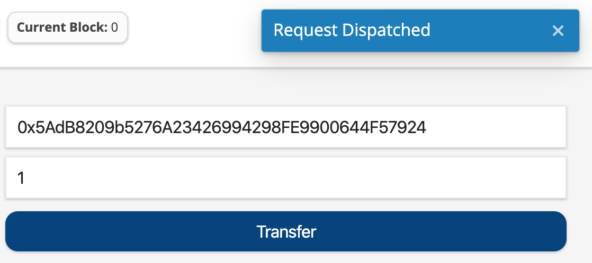

# Ethers React App

A decentralized application starter kit for React developers.

<strong>WARNING</strong><br/>
The `ethers-react-app` projects and `@ethers-react` modules are under active development.

<strong>Expect API changes.</strong>

Several non-standard Webpack configurations are included in the dApp Demo Applications to simplify (in my opinion) the developer experience. For example, the React module is automatically injected when it's required, so developer's don't have to include `import React from 'react'` every time a new component is created.

The [developer experience enhancements](#developer-experience-enhancements) section includes the non-standard configurations to simplify development.

<strong>Active Development</strong><br/>
The `ethers-react-app` project (v0.0.0) is the playground for <strong>hardening</strong> the `@ethers-react` module family.

Consider the project experimental and a minimal viable product for utilizing `hooks` to build Web3 frontend applications. The current approach was chosen, because from the perspective of Core Contributors (@kamescg) it's important to create an API that will be useful in real-world applications and also be easy for new developers to understand.

By creating the `ethers-react` library, in conjunction with non-trivial decentralized applications, a mature solution can arrived at more quickly.

Have a question? Open a ticket.

Want to recommend a change to the API? Open a ticket.

Interested in creating an extension to add functionality? You guessed it! Open a ticket.

# Overview

- [Application Development](#application-development)
- [Module Development](#module-development)
- [Ethers React](#ethers-react-libraries)
  - [System](docs/modules/ethers-react-system.md)
  - [Reactive](docs/modules/ethers-react-reactive.md)
  - [Providers](docs/modules/ethers-react-providers.md)
  - [Globalize](docs/modules/ethers-react-Globalize.md)
- [Applications](#ethers-react-libraries)
  - [Dashboard](docs/apps/ethers-react-app-dashboard.md)
- [Getting Started](#getting-started)

## Getting Started

The `ethers-react-app` project is managed using Lerna. While, it's not required to be familiar `lerna` to setup the `ethers-react-app` demo applications, it might help. If you are having trouble running a demo application, please reference the Troubleshoot section for useful tips.

Several demo applications can be found in the `apps/` folder.

To run a demo dApp, first install the project dependencies, then start the project from a child folders.

```bash
$ git clone git@github.com:horizin/ethers-react-apps.git

$ cd ethers-react-apps

$ yarn

$ cd ./app/basic ; yarn start

$ cd ./app/dashboard ; yarn start

$ cd ./app/ens-certificate ; yarn start

```

### Application Development

The demo applications are under active development, but can generally be considered stable. You can preview the decentralized applications using the standard project commands `yarn start` and `yarn build`

### Module Development

The `@ethers-react` module are located in the `packages/ethers-react/packages` folder. Once the code is stable, the modules will be made available in the NPM registry. For now, module development will occur in the `ethers-react-app` project located in the [Horizin Github Organization](https://github.com/horizin/) repo, so modules can be be more easily tested with demo applications.

# Ethers React `ethers-react` Libraries

The `ethers-react` project is a collection of JS modules. The modules are categorized as extension, interface or both. In other words a `@ethers-react/LIBRARY` module will export `extension` or `interface` functionality and sometimes both.

Extension modules export the `extension` object, which can be passed into the `<EthersProvider />` component.

Inteface modules export React `<Component/>`'s which generally reference a `EthersContext` instance.

**Extension Example**<br/>
`import { extension as Reactive } from "@ethers-react/reactive";`

**Interface Example**<br/>
`import { Address } from "@ethers-react/ui";`

**Extension & Interface Example**<br/>
`import { extension, ProviderSelect } from "@ethers-react/providers";`

## Core System `@ethers-react/system`<br/>

The `@ethers-react/system` library is the core of the `ethers-react` module.

The library is responsible for the application’s primary blockchain state management, exposing React hooks (side-effect management) for easily interacting with the Ethereum blockchain and managing additional functionality to be added using a minimal extension management system. Instead of relying on popular application state management systems like Redux, the library manages the application's state via the `useContext` functionality now provided by the core `react` module. In addition to using React's native lightweight state management, the new hook paradigm (useState, useEffect and useReducer) is used to manage the lifecycle of common interactions with the Ethereum blockchain (transactions, smart contracts, events, etc...). Finally, the `@ethers-react/system` enables developers to easily extend core library functionality using an extension, so it's possible to extend the `@ethers-react/system` library with additional features provided by other Web3 libraries like [Web3Modal](https://github.com/Web3Modal/web3modal) and [3Box](https://github.com/3box/3box-js).

The `@ethers-react/system` library is built for extensibility.

Providing minimal functionality (keeping the library small), while also enabling developers to easily enhance and extend core functionality.

For example, instead of including reactive functionality in the primary library (which would limit a developer's ability to control important state management changes i.e. changing the network or wallet) the `@ethers-react/reactive` library which adds <strong>"reactive"</strong> functionality as an extension.

Additionally the `@ethers-react/system` library is built to easily interact with an application's design system. For example the `useContractSendTransaction` hook is designed to communicates with the `useTransactionToast` hook provided by the `@ethers-react/ui-blueprint` module. The `useTransactionToast` listens for state changes emitted from the `useContractSendTransaction` hook and triggers a toast messages during the transactions lifecycle changes.

```js
import { hooks } from "@ethers-react/system";
import { useTransactionToast } from "@ethers-react/ui-blueprint";

const contractTransaction = hooks.useContractSendTransaction(contractName);
const toast = useTransactionToast(contractTransaction);
```



In other words, the `ethers-react` module is designed to track state changes when interacting with the Ethereum blockchain and triggering the appropriate side-effects in a decentralized application's interface.

In contrast...

The `web3-react` module focuses on application blockchain state management.

The `rimble-ui` module focuses on Ethereum blockchain interface components.

The `web3-react` and `rimble-ui` modules each provide 1/2 of the decentralized application

On the hand `ethers-react` module includes both <strong>application blockchain state management</strong> and <strong>common interface components</strong> into a single library, while still providing flexibility and control for the developer. New features and capabilities can easily be added both from a state management and interface design approach.

Now that you have a baseline understanding of the challenges `ethers-react` attempts to solve, let's get to the specifics.

#### System Features

- Ethers Hooks
  - useContractRead
  - useContractSendTransaction
  - useGetTransaction
  - useGetTransactionReceipt
  - useTransactionWatch
  - useWalletEstimateTransaction
  - useWalletSignTransaction
  - useWalletSendTransaction
  - useWalletSignMessage
  - useWalletSignTypedMessage
  - useWalletSignTypedMessageV3
  - useWalletSignTypedMessageV4
- Reactive Hooks
  - useContractConnect
  - useWalletEnable
- Extension System
  - enhanceExtensionActions
  - extensionsInitialize
  - combineExtensionInitialState
  - combineExtensionsReducers

### System Hooks

Ethers Hooks are the primary method for interacting with the underlying `ethers` library. Decentralized applications often require interaction with one or more smart contracts running on an Ethereum blockchain. Hooks such as `useContractRead` and `useContractSendTransaction` simplify the steps required to interact with these smart contracts.

Because interacting with smart contracts is the primary means for interacting with the blockchain, below is a simplified example of how to add Ethereum blockchain functionality to a basic React application. To see a real-world example run the `token-app` demo, which automatically loads an ERC20 smart contract and provides all of the essential functionality by importing the `ethers-react/token` module

### Example of Hooks

To fully understand the importance of hooks in the `ethers-react` library let’s take a deep dive into an application's most important functionality - interacting with smart contracts. For a full overview of all the hooks `ethers-react/system` hooks checkout the [System Hooks Documentation](docs/system-hooks-documentation).

#### useContractSendTransaction

The `useContractSendTransaction` is responsible for connecting to a smart contract (via the `useSelectContractByName` selector) and managing a transaction lifecycle. First, the hook will locate the contract in the application's global state and wait for the contract to be connected to the network (once the injected wallet has been enabled). Once the smart contract has been properly initialized, the hook will kickstart the transaction lifecycle management process.

If you're unfamiliar with the user experience associated with a blockchain state change, let's do a brief overview.

_Transaction Lifecycle_

- initialized
- requested
  - rejected
  - confirmed
- broadcast
  - dispatch
  - error
- confirm
  - success
  - failure

Similar to traditional Web2 application, which require reads and writes to a database, a Web3 application has a very similar process, expect with a few additional steps, depending on the specific interaction.

<strong>Hook State</strong>
A `useContractSendTransaction` hook transaction has 4 lifecycle states: initialized, requested, broadcast and confirmed.

Every time the hook undergoes a lifecycle state change the returned state is updated. The lifestyle state can be can used to trigger secondary effects, whether that's updating an interface component or triggering a secondary effects.

```js
const contractTransaction = hooks.useContractSendTransaction(contractName);

sendTransaction: ({ func, inputs, contractName, params }) => {…}
setContractName: contractName => {…}
lifecycle: undefined
hash: undefined
broadcast: undefined
broadcastError: undefined
broadcastErrorCode: undefined
receipt: undefined
receiptStatus: undefined
confirmedError: undefined
isBroadcast: false
isConfirmed: false
isRejected: false
isRequesting: false
isContractConnected: false
isContractFound: false
```

#### Application.js

```js
import MeshDevCoin from "@contracts/MeshDevCoin.json";
import ERC20 from "@contracts/ERC20.json";
import TokenTransfer from "@forms/TokenTransfers";

export const contracts = [
  MeshDevCoin,
  {
    abi: ERC20.abi,
    bytecode: ERC20.bytecode,
    id: "TokenFactory"
  }
];

export default ({ children }) => {
  return (
    <EthersProvider contracts={contracts}>
      <TokenTransfer contractName="MeshDevCoin" />
    </EthersProvider>
  );
};
```

#### TokenTransfers.js

```js
import { useForm } from "react-hook-form";
import { hooks } from "@ethers-react/system";
export const TokenTransfer = (props) => {
  /* --- Hooks : State --- */
  const contractTransaction = hooks.useContractSendTransaction(contractName);

  /* --- Local : State --- */
  const { handleSubmit, register, errors } = useForm();

  /* --- Actions : Form  --- */
  // Submit : Action : Form
  const onSubmit = async values => {
    contractTransaction.sendTransaction({
      contractName: props.contractName, // "MeshDevCoin"
      func: "transfer",
      inputs: [values.address, values.amount],
      params: {}
    });
  };
...
```

If you've built a decentralized application before the first thing you might have noticed is a very small amount of code is required to interact with the Ethereum blockchain when using the `ethers-react` modules.

The developer experience is dramatically simplified.<br/>
Focus on the user experience. Less on managing the complexity of Web3.

Hooks provide a predictable pattern for managing a number of different interactions,

A majority of the logic normally required to interact with wallet provider (i.e MetaMask or Fortmatic) is abstracted behind several hooks

The library provides generic hooks for dispatching transactions, initializing contracts and manages extension initialization.

- `@ethers-react/system` (core)

Extension & Interface Libraries<br/>

- `@ethers-react/reactive` (extension)
- `@ethers-react/global` (extension)
- `@ethers-react/providers`(extension/interface)
- `@ethers-react/ui`(interface)
- `@ethers-react/ui-blueprint` (interface)
- `@ethers-react/tokens`(interface)
- `@ethers-react/tokens-blueprint`(interface)

## System (`@ethers-react/system`)

The `@ethers-react/system` library exposes functionality via `hooks`, `withEthers`, `EthersProvider`, `EthersInject` and `selectors`.

```jsx
import { EthersProvider } from "@ethers-react/system";

export default ({ children }) => {
  return <EthersProvider contracts={contracts}>{children}</EthersProvider>;
};
```

#### Contract Loading

Decentralized applications communicate with smart contracts on the Ethereum blockchain.

Smart Contract artifacts (JSON outputs from build process) can be passed directly in the `<EthersProvider/>` component. By passing smart contracts (artifacts) `EthersProvider` component developers don't have to manage contract initialization. Everything is handled when a blockchain `provider` and wallet `signer` are initialized.

The `@ethers-react/system` library manages contract initialization, so you don't have too.

```jsx
/* --- Modules --- */
import { EthersProvider } from "@ethers-react/system";
import MeshDevCoin from "@contracts/MeshDevCoin.json";
import ERC20 from "@contracts/ERC20.json";

/* --- Contracts --- */
export const contracts = [
  MeshDevCoin,
  {
    abi: ERC20.abi,
    bytecode: ERC20.bytecode,
    id: "TokenFactory"
  }
];

export default ({ children }) => {
  return <EthersProvider contracts={contracts}>{children}</EthersProvider>;
};
```

### Extensions

The `@ethers-react/system` can be passed `ethers-react` extensions. Extensions add functionality, which are not available in the system library. Currently (v0.0.0) only a handful of extensions are available: reactive and providers.

In the future, additional extensions might be made available to functionality like transaction/event caching and a global state management system.

Core Extensions

- `@ethers-react/reactive`
- `@ethers-react/provider`

Future Extensions

- `@ethers-react/globalize`
- `@ethers-react/caching`

#### Reactive

The `@ethers-react/reactive` library automatically handles a number of important application state updates, such as exposing a wallet address, signer, nonce, balance and others.

- useAccountOnChange
- useBlockMined
- useNetworkOnChange
- useWalletAddress
- useWalletNetwork
- useWalletBalance
- useWalletNonce
- useWalletProviderInitialize
- useWalletSignerGet

Including the `reactive` extension module is highly recommended, unless an alternative extension is provided to handle <strong>critical</strong> application functionality like initializing the provider signer (i.e. wallet) during application runtime.

Reactive features can be toggled on/off by editing the `settings` of the imported `extension` object exported from the `@ethers-react/reactive` module.

```js
/* --- Modules --- */
import { EthersProvider } from "@ethers-react/system";
import { extension as Reactive } from "@ethers-react/reactive";

/* --- Reactive --- */
Reactive.settings.getAccountBalance = true;
Reactive.settings.getAccountNonce = true;
Reactive.settings.getAccountOnLoad = true;
Reactive.settings.getProviderSigner = true;
Reactive.settings.getWalletProviderInitialize = false;
Reactive.settings.watchAccountOnChange = true;
Reactive.settings.watchBlockCurrent = true;
Reactive.settings.getWalletAddress = true;
Reactive.settings.getWalletNetwork = true;
Reactive.settings.getWalletNonce = true;

export default ({ children }) => {
  return <EthersProvider extensions={[Reactive]}>{children}</EthersProvider>;
};
```

#### Providers

The `@ethers-react/provider` library adds the `Web3Modal` to simplify provider selection options.

```js
/* --- Modules --- */
import { EthersProvider } from "@ethers-react/system";
import { extension as Providers } from "@ethers-react/providers";

// Web3Modal & Plugins
import Web3Modal from "web3modal";
import Fortmatic from "fortmatic";
import BurnerConnectProvider from "@burner-wallet/burner-connect-provider";
import WalletConnectProvider from "@walletconnect/web3-provider";

/* --- Providers --- */
const providerOptions = {
  fortmatic: {
    package: Fortmatic, // required
    options: {
      key: "INSERT_KEY"
    }
  },
  burnerconnect: {
    package: BurnerConnectProvider,
    options: {}
  },
  walletconnect: {
    package: WalletConnectProvider,
    options: {
      infuraId: "INSERT_ID" // required
    }
  }
};

const web3Modal = new Web3Modal({
  network: "mainnet",
  cacheProvider: false,
  providerOptions
});

Providers.initialState = {
  web3Modal: web3Modal
};

export default ({ children }) => {
  return <EthersProvider extensions={[Providers]}>{children}</EthersProvider>;
};
```

### Hooks

### Reactive

# Developer Experience Enhancements

The demo applications are configured to simplify active. development by including folders alias and automatically injecting commonly used modules like `react` and the `theme-ui` design system
